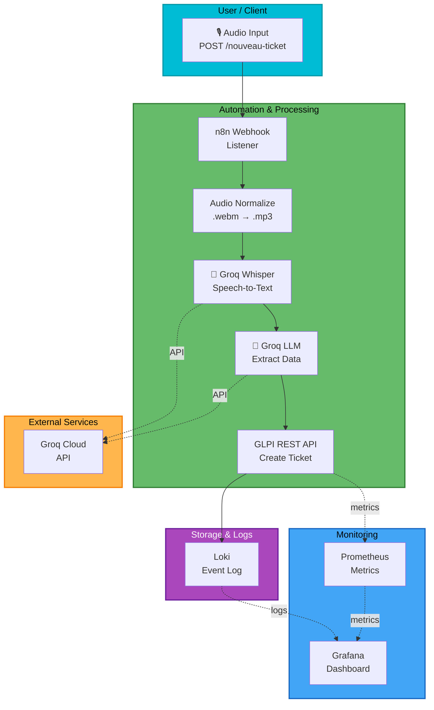

# GLPI + n8n + Grafana Monitoring Stack

A containerized automation platform that connects GLPI IT ticketing with n8n workflow automation and a Grafana monitoring stack. The project enables audio-based ticket creation through AI transcription, real-time dashboards, and log aggregation.

## Demo Video

<video width="100%" controls>
  <source src="docs/screenshots/Video_Project.mp4" type="video/mp4">
  Your browser does not support the video player.
</video>

## What It Does

This project integrates three core systems:

1. **GLPI** — Open-source IT asset management and ticketing system running in Docker
2. **n8n** — Workflow automation engine that listens for audio input, transcribes it with Groq Whisper, extracts structured data with Groq LLM, and automatically creates GLPI tickets
3. **Monitoring Stack** — Prometheus, Grafana, Loki, and Promtail for metrics, dashboards, and log aggregation across all services

## Problem Solved

Organizations need a way to:
- Create IT support tickets quickly without manual form entry
- Automate data collection and processing between tools
- Monitor system health and workflow execution
- Centralize logs from multiple containers

This stack provides automation to collect voice-based support requests, process them with AI, and immediately create actionable tickets in GLPI, while simultaneously tracking all system activity.

## Quick Architecture Overview



## Main Components

### 1. GLPI (infra/glpi-docker-compose.yml)
- **Role**: Central IT ticketing and asset management system
- **Port**: 8080 (HTTP only in Docker)
- **Database**: MySQL 8.0 in Docker
- **Integration**: REST API consumed by n8n workflows
- **See Also**: [docs/05-glpi-integration.md](docs/05-glpi-integration.md)

### 2. n8n Workflows (n8n/workflows/workflows.json)
- **Two Active Workflows**:
  - **"My workflow"** — Basic audio → AI → ticket flow
  - **"Click & Speak ITSM"** — Enhanced version with Loki logging integration
- **Trigger**: HTTP POST to `/nouveau-ticket` webhook endpoint
- **External APIs**: Groq (Whisper + LLM), GLPI REST API, Loki
- **See Also**: [docs/04-n8n-workflows.md](docs/04-n8n-workflows.md)

### 3. Monitoring Stack (infra/)
- **Prometheus** — Metrics collection from n8n, app, cAdvisor
- **Grafana** — Dashboards and visualization
- **Loki** — Log aggregation
- **Promtail** — Log shipper
- **See Also**: [docs/07-monitoring-stack.md](docs/07-monitoring-stack.md)

### 4. Dashboard App (dashboard/app/)
- **Language**: Go (from Grafana monitoring workshop)
- **Purpose**: Sample TNS (Tns Observability) application for testing monitoring
- **Runs on**: Port 80 in Docker
- **See Also**: [docs/06-dashboard.md](docs/06-dashboard.md)

## Getting Started

### Prerequisites
- Docker and Docker Compose installed
- Groq API key (free at https://console.groq.com/)
- For Windows/Mac: Docker Desktop or equivalent

### Installation & Setup

1. **Clone and navigate to project**:
   ```bash
   cd glpi-n8n-dashboard
   ```

2. **Configure environment variables**:
   - Copy `.env.example` to `.env`
   - Add your Groq API key and any custom configuration
   - See [docs/03-configuration.md](docs/03-configuration.md)

3. **Start GLPI stack**:
   ```bash
   docker-compose -f infra/glpi-docker-compose.yml up -d
   ```

4. **Start monitoring stack** (optional):
   ```bash
   docker-compose -f infra/tutorial-environment-docker-compose.yml up -d
   ```

5. **Configure n8n**:
   - Open http://localhost:5678
   - Import workflow from `n8n/workflows/workflows.json`
   - Set Groq API credentials and GLPI endpoint credentials
   - See [docs/04-n8n-workflows.md](docs/04-n8n-workflows.md)

6. **Access Services**:
   - **GLPI**: http://localhost:8080
   - **n8n**: http://localhost:5678
   - **Grafana**: http://localhost:3000
   - **Prometheus**: http://localhost:9090

For detailed setup, see [docs/02-installation.md](docs/02-installation.md).

## Documentation Index

- [00-project-overview.md](docs/00-project-overview.md) — High-level project context and goals
- [01-architecture.md](docs/01-architecture.md) — System design with Mermaid diagrams
- [02-installation.md](docs/02-installation.md) — Step-by-step local setup guide
- [03-configuration.md](docs/03-configuration.md) — Environment variables and secrets management
- [04-n8n-workflows.md](docs/04-n8n-workflows.md) — Workflow documentation, nodes, and flow
- [05-glpi-integration.md](docs/05-glpi-integration.md) — GLPI REST API, authentication, endpoints
- [06-dashboard.md](docs/06-dashboard.md) — Dashboard app, running, building
- [07-monitoring-stack.md](docs/07-monitoring-stack.md) — Prometheus, Grafana, Loki, Promtail setup
- [08-docker-services.md](docs/08-docker-services.md) — Docker Compose files, networking, volumes
- [09-troubleshooting.md](docs/09-troubleshooting.md) — Common issues and solutions
- [10-security-and-secrets.md](docs/10-security-and-secrets.md) — Secret management, .env, credential handling

## Configuration

This project requires sensitive configuration (API keys, credentials). Never commit real secrets.

- **Local**: Use `.env` file (git-ignored)
- **Example**: See `.env.example` for required variables
- **Production**: Use container orchestration secrets management (Kubernetes, Docker Swarm, etc.)

See [docs/03-configuration.md](docs/03-configuration.md) and [docs/10-security-and-secrets.md](docs/10-security-and-secrets.md).

## Security & Secrets

### What Must Never Be Committed
- `.env` file with real values
- n8n credential exports
- GLPI tokens or app tokens
- Groq API keys
- Database passwords
- SSH keys, certificates, PEM files

### How to Stay Safe
1. Keep `.env` file local (excluded by .gitignore)
2. Use `.env.example` as a template for configuration
3. Export n8n workflows without embedded credentials
4. Review all files before commit: `git diff --cached`
5. Rotate all keys periodically, especially if exposed

See [docs/10-security-and-secrets.md](docs/10-security-and-secrets.md) for detailed guidance.

## Troubleshooting

Common issues and solutions are documented in [docs/09-troubleshooting.md](docs/09-troubleshooting.md).

Quick checks:
- GLPI not responding? Check MySQL container: `docker ps`
- n8n can't reach GLPI? Verify Docker network and `host.docker.internal` availability
- Workflow failing? Check n8n logs: `docker logs n8n` and review execution history
- Metrics not appearing? Verify Prometheus targets: http://localhost:9090/targets

## Project Status & Limitations

### What Works
- Audio → Transcription → Ticket creation flow
- GLPI REST API integration
- Monitoring stack collection and visualization
- Local Docker-based development environment

### Known Limitations & TODOs
- GLPI uses HTTP-only (no HTTPS in Docker setup)
- Credentials in n8n workflows are hardcoded for demo (should use environment variables in production)
- Dashboard app is from upstream Grafana workshop, not custom
- No persistent n8n workflow storage across Docker restarts (use backup/export regularly)
- Loki storage is ephemeral (no persistent volume configured)

### Future Work
- [ ] Add email notification triggers
- [ ] Implement GLPI Change Management automation
- [ ] Add user feedback loop to ticket creation
- [ ] Multi-language support for LLM extraction
- [ ] Kubernetes deployment manifests
- [ ] CI/CD pipeline integration tests

## Contributing

This is a personal project prepared for GitHub reference. Suggestions welcome via issues.

## License

[Specify license, e.g., MIT]

---

**For detailed technical documentation, see the [docs/](docs/) folder.**
