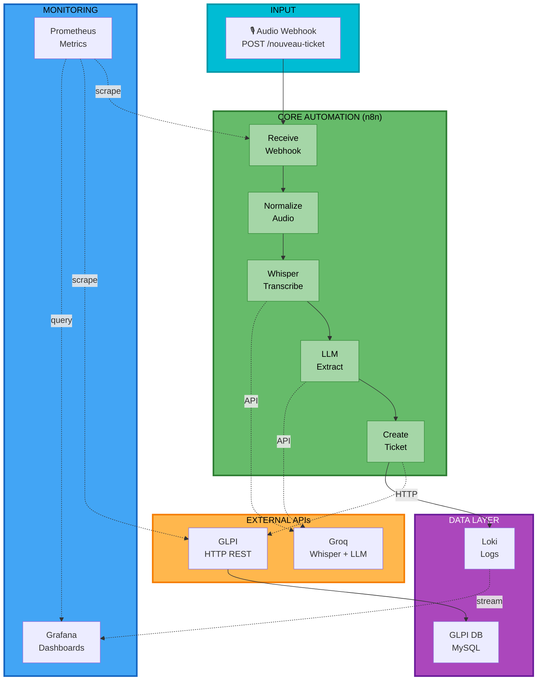
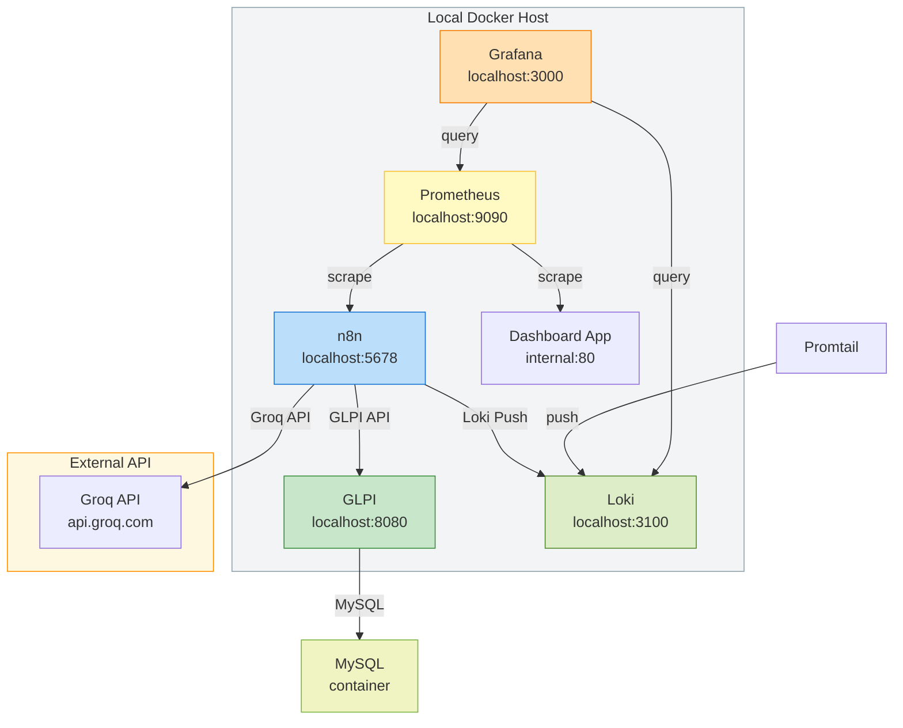
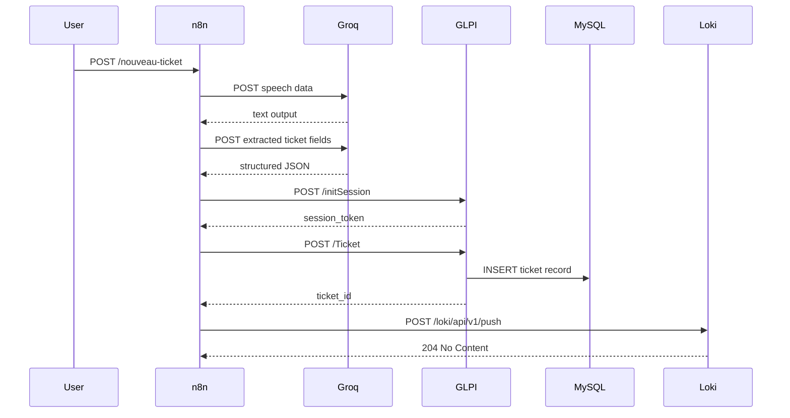
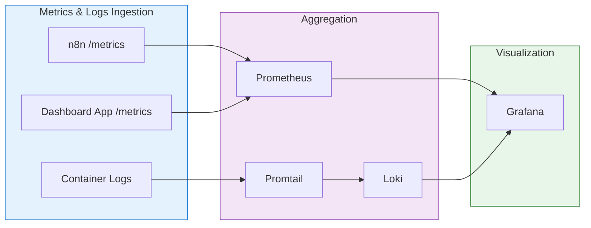

# Architecture

## High-Level System Design

This diagram shows the primary data flow: audio input through n8n automation, API calls to Groq and GLPI, storage in databases, and monitoring visibility across all layers.

## Workflow Sequence

```mermaid
flowchart LR
    A["1. Receive Audio<br/>HTTP POST /nouveau-ticket"]
    B["2. Normalize Audio<br/>(.webm → .mp3)"]
    C["3. Transcribe<br/>Groq Whisper"]
    D["4. Extract Fields<br/>Groq LLM"]
    E["5. Format Payload<br/>Ticket JSON"]
    F["6. Authenticate<br/>GLPI Session"]
    G["7. Create Ticket<br/>POST /Ticket"]
    H["8. Record Log<br/>Loki Event"]
    I["9. Display Metrics<br/>Grafana Dashboard"]

    A --> B --> C --> D --> E --> F --> G --> H
    H --> I
    style A fill:#e1f5fe,stroke:#0288d1
    style C fill:#fff3e0,stroke:#ef6c00
    style D fill:#fff3e0,stroke:#ef6c00
    style F fill:#e8f5e9,stroke:#2e7d32
    style G fill:#e8f5e9,stroke:#2e7d32
    style H fill:#f1f8e9,stroke:#558b2f
    style I fill:#f3e5f5,stroke:#1565c0
```

The workflow breaks down the key steps in the n8n automation path: audio intake, AI transcription, extraction, ticket creation, and logging.

## Container Networking

This network diagram documents how local containers are exposed, which services scrape metrics, and which external API is required.

## GLPI Integration Sequence

This sequence diagram highlights the message flow between n8n, Groq, GLPI, and Loki during ticket creation.

## Monitoring Data Flow

The monitoring flow clarifies where metrics and logs are collected, aggregated, and surfaced in Grafana.

## Error Handling & Fallbacks

### Current State
- n8n has `maxTries: 5` on GLPI requests (retry on fail)
- `alwaysOutputData: true` on critical nodes (continue even if previous step fails)
- Error logs posted to Loki for visibility

### Recommended Improvements
- [ ] Add error notification webhook
- [ ] Implement dead-letter queue for failed tickets
- [ ] Add circuit breaker for Groq API failures
- [ ] Implement exponential backoff for transient failures
- [ ] Create alerting rules in Grafana for workflow failures

---

See [02-installation.md](02-installation.md) for how to stand up this architecture locally.
