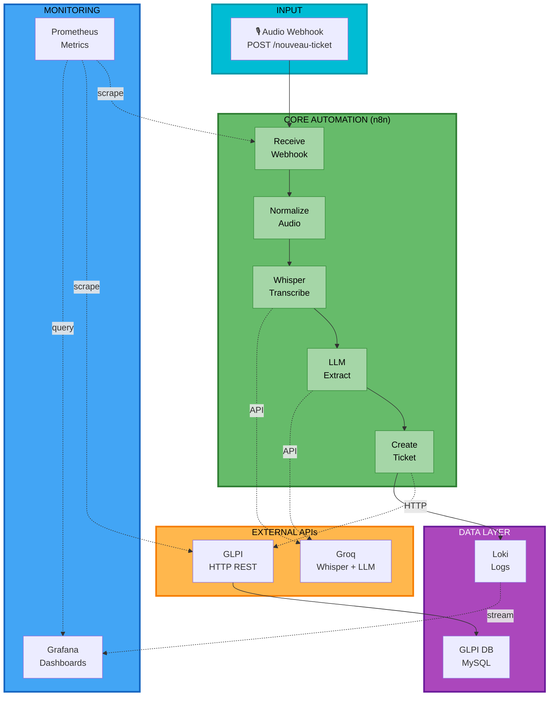
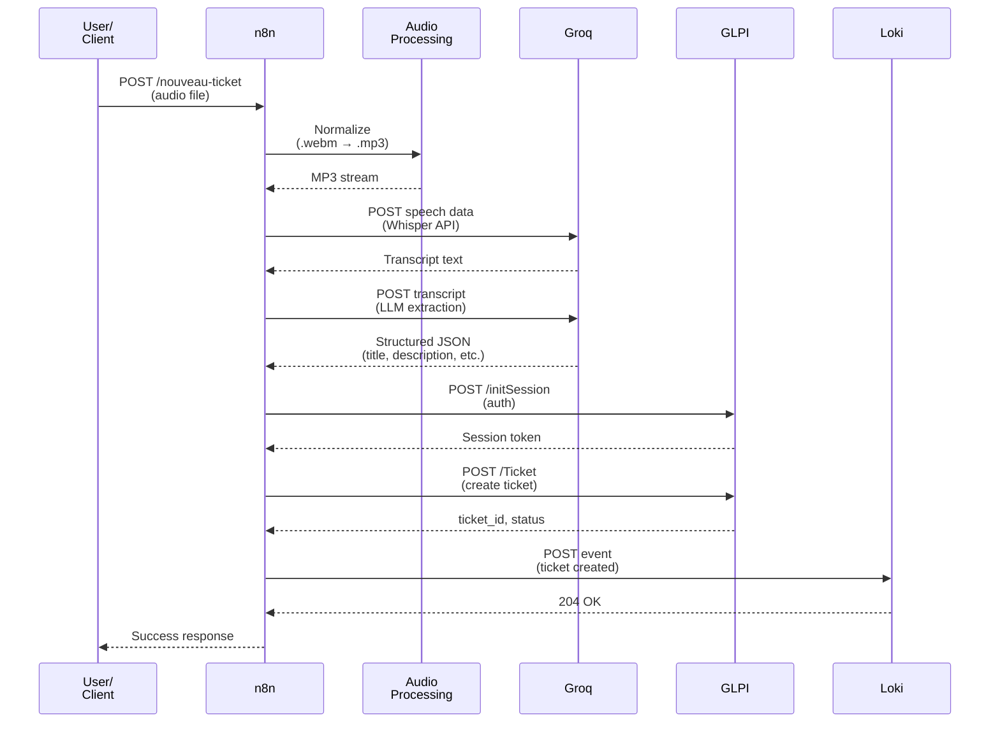
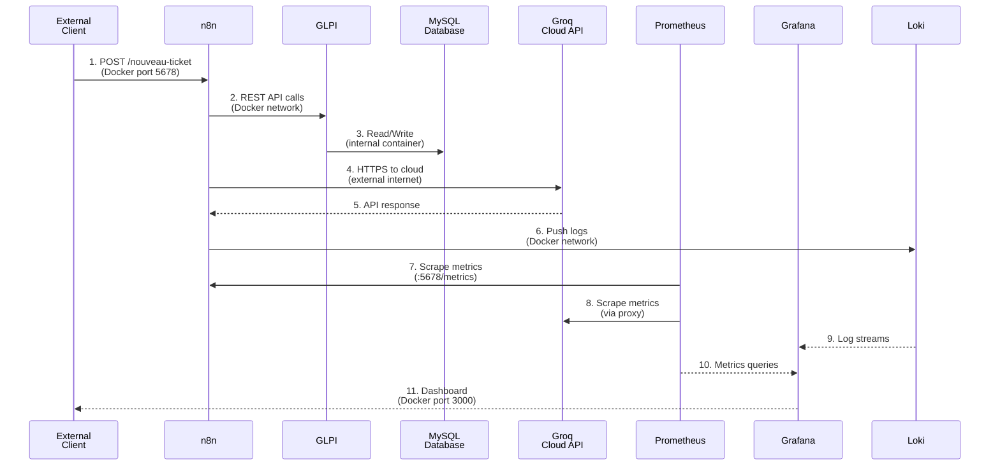
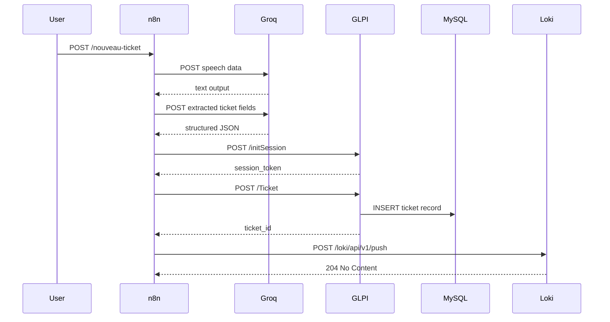
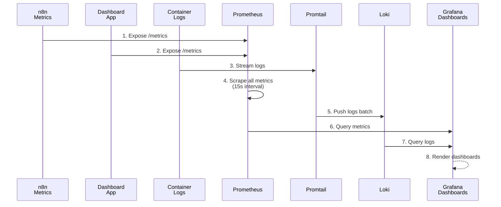

# Architecture

## High-Level System Design

This diagram shows the primary data flow: audio input through n8n automation, API calls to Groq and GLPI, storage in databases, and monitoring visibility across all layers.

## Workflow Sequence

This sequence shows the complete workflow: audio reception, normalization, AI transcription and extraction, GLPI authentication and ticket creation, and event logging.

## Container Networking

This sequence depicts the network communication flow: client connections to exposed ports (5678, 3000), inter-container traffic over Docker network, and external API calls to Groq.

## GLPI Integration Sequence

This sequence diagram highlights the message flow between n8n, Groq, GLPI, and Loki during ticket creation.

## Monitoring Data Flow

This sequence illustrates the observability pipeline: metrics scraped by Prometheus, logs shipped by Promtail to Loki, and both data sources queried by Grafana for visualization.

## Error Handling & Fallbacks

### Current State
- n8n has `maxTries: 5` on GLPI requests (retry on fail)
- `alwaysOutputData: true` on critical nodes (continue even if previous step fails)
- Error logs posted to Loki for visibility

### Recommended Improvements
- [ ] Add error notification webhook
- [ ] Implement dead-letter queue for failed tickets
- [ ] Add circuit breaker for Groq API failures
- [ ] Implement exponential backoff for transient failures
- [ ] Create alerting rules in Grafana for workflow failures

---

See [02-installation.md](02-installation.md) for how to stand up this architecture locally.
