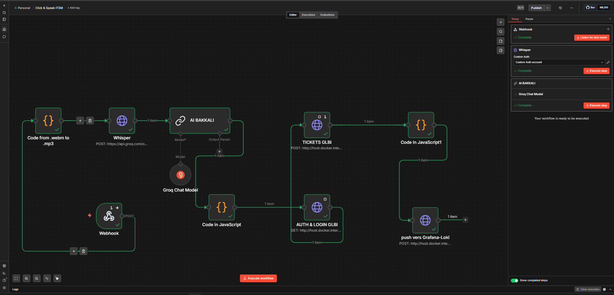
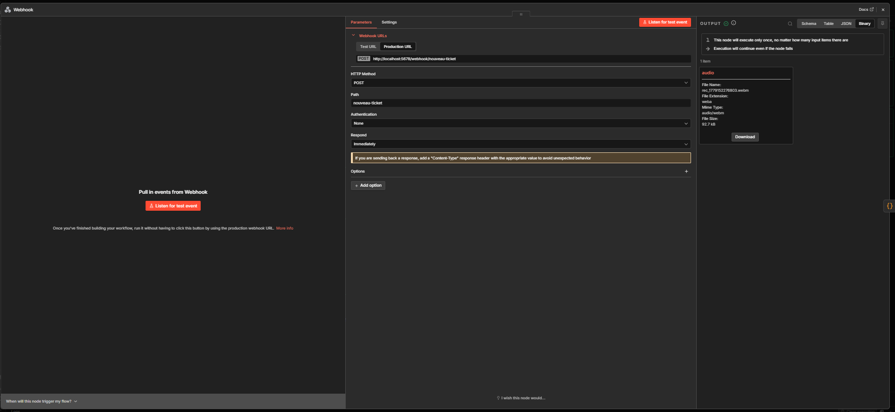

# n8n Workflows

## Workflow Overview

Two workflows are exported in `n8n/workflows/workflows.json`:

| Workflow | Status | Purpose | Trigger |
|----------|--------|---------|---------|
| "My workflow" | Inactive (Demo) | Basic audio → ticket flow | HTTP Webhook POST `/nouveau-ticket` |
| "Click & Speak ITSM" | Active | Production workflow with Loki logging | HTTP Webhook POST `/nouveau-ticket` |

Both workflows implement the same core logic with slightly different error handling and logging.

## Workflow Architecture

### High-Level Flow

```
Webhook Input (audio file + metadata)
    ↓
Convert Audio Format (.webm → .mp3)
    ↓
Groq Whisper API (transcribe to text)
    ↓
Groq LLM (extract structured ticket data)
    ↓
GLPI Authentication (get session token)
    ↓
GLPI Create Ticket (POST with extracted data)
    ↓
Log to Loki (record event)
    ↓
Return Success Response
```

### Visual Workflow Diagram



Complete node-level visualization showing:
- Audio input → format conversion
- Whisper API transcription node
- AI BAKKALI (Groq LLM) for structured data extraction
- GLPI authentication and ticket creation
- Loki logging for audit trail
- Output parsing and error handling

### Webhook Configuration



Webhook setup panel showing:
- HTTP POST endpoint configuration
- Custom body parameters (e.g., `naouveau-ticket`)
- Request/response handling
- Production webhook URL

## "Click & Speak ITSM" Workflow (Recommended)

This is the more complete workflow with better error handling and monitoring.

### Nodes & Configuration

#### 1. Webhook

**Type**: `n8n-nodes-base.webhook`

**Config**:
- Method: POST
- Path: `nouveau-ticket`
- Execute Once: ✓ (only trigger once even if request retried)

**Input Expectations**:
```json
{
  "audio": "<binary audio data>",
  "name": "User Name (optional)",
  "description": "Brief description (optional)"
}
```

**Output**:
- `item.binary.audio` — binary audio data
- `item.json` — any JSON fields from POST body

#### 2. Code: Convert .webm to .mp3

**Type**: `n8n-nodes-base.code` (JavaScript)

**Purpose**: Normalize audio format before Whisper API (which expects MP3)

**Code**:
```javascript
const item = $input.first();

// Get first binary file
const binaryKey = Object.keys(item.binary)[0];
console.log('Binary key found:', binaryKey);
console.log('Current mime:', item.binary[binaryKey].mimeType);

// Force rename to mp3
item.binary[binaryKey].fileName = 'audio.mp3';
item.binary[binaryKey].mimeType = 'audio/mpeg';
item.binary[binaryKey].fileExtension = 'mp3';

return item;
```

**Output**: Modified item with `.mp3` extension and MIME type

**Failure Points**:
- No binary data in request → throws error
- File too large → upload fails

#### 3. Whisper (Speech-to-Text)

**Type**: `n8n-nodes-base.httpRequest`

**Config**:
- Method: POST
- URL: `https://api.groq.com/openai/v1/audio/transcriptions`
- Authentication: HTTP Custom Auth (Groq API key)
- Content-Type: `multipart-form-data`
- Body Parameters:
  - `file` (binary): audio file
  - `model`: `whisper-large-v3`
  - `response_format`: `json`

**Credentials Required**: Groq API Key

**Output**:
```json
{
  "text": "Full transcribed text of audio"
}
```

**Failure Points**:
- Invalid Groq API key
- Audio file corrupted or unsupported format
- API rate limit exceeded
- Audio too long (>25MB)

#### 4. AI BAKKALI (LLM Extraction)

**Type**: `@n8n/n8n-nodes-langchain.chainLlm`

**Config**:
- Model: Groq Chat Model (llama-3.3-70b-versatile)
- Prompt Type: Define
- Prompt Template:
  ```
  You are an IT helpdesk assistant.
  Extract info from the transcription and reply with ONLY this JSON, nothing else:
  
  {"name":"full client name","description":"full problem description","urgency":1,"priority":3,"type":1,"device":"device or equipment name","location":"floor or office location"}
  ```
- Input: `$json.text` from Whisper output

**Output**: JSON object with structured ticket data

```json
{
  "name": "John Smith",
  "description": "Printer not working on floor 3",
  "urgency": 3,
  "priority": 3,
  "type": 1,
  "device": "Printer HP LaserJet",
  "location": "Floor 3, Room 302"
}
```

**Failure Points**:
- Groq API key invalid
- LLM hallucinating/not returning valid JSON
- Transcription too garbled to understand

**Solution**: Add additional code node to validate JSON before GLPI call

#### 5. Groq Chat Model

**Type**: `@n8n/n8n-nodes-langchain.lmChatGroq`

**Config**:
- Model: `llama-3.3-70b-versatile`
- Credentials: Groq API Key

This node powers the AI BAKKALI node above. Configured separately for flexibility.

#### 6. Code: Parse JSON

**Type**: `n8n-nodes-base.code` (JavaScript)

**Purpose**: Clean and validate LLM output, handle malformed JSON

**Code**:
```javascript
const raw = $input.first().json.text;
const clean = raw.replace(/```json|```/g, '').trim();
const parsed = JSON.parse(clean);

return [{
  json: {
    name: parsed.name,
    description: parsed.description,
    urgency: parsed.urgency,
    priority: parsed.priority,
    type: parsed.type,
    device: parsed.device,
    location: parsed.location
  }
}];
```

**Output**: Validated ticket data

**Failure Points**:
- LLM returned non-JSON text
- Missing required fields

#### 7. AUTH & LOGIN GLPI

**Type**: `n8n-nodes-base.httpRequest`

**Config**:
- Method: POST
- URL: `http://host.docker.internal:8080/apirest.php/initSession`
- Send Headers: ✓
- Header: `Authorization: Basic Z2xwaTpnbHBp` (base64 encoded `glpi:glpi`)
- Always Output Data: ✓ (continue even if auth fails)

**Output**:
```json
{
  "session_token": "abcd1234...",
  "sessionId": 1,
  "message": "logged in"
}
```

**Failure Points**:
- GLPI endpoint not reachable (network issue)
- Credentials incorrect
- GLPI API not enabled

**Note**: Hardcoded credentials for demo. For production, store in n8n Credentials and reference with `{{ $vars.GLPI_PASSWORD }}`.

#### 8. TICKETS GLPI (Create Ticket)

**Type**: `n8n-nodes-base.httpRequest`

**Config**:
- Method: POST
- URL: `http://host.docker.internal:8080/apirest.php/Ticket`
- Send Headers: ✓
- Header: `Session-Token: {{ $('AUTH & LOGIN GLBI').item.json.session_token }}`
- Body (JSON):
  ```json
  {
    "input": {
      "name": "{{ $('Code in JavaScript').item.json.name }}",
      "content": "{{ $('Code in JavaScript').item.json.description }} | Device: {{ $('Code in JavaScript').item.json.device }} | Location: {{ $('Code in JavaScript').item.json.location }}",
      "urgency": 3,
      "priority": 3,
      "type": 1
    }
  }
  ```
- Always Output Data: ✓
- Execute Once: ✓
- Max Tries: 5 (retry on fail)

**Output**:
```json
{
  "id": 12345,
  "name": "Ticket Name",
  "status": 1,
  "message": "Ticket created successfully"
}
```

**Failure Points**:
- Session token expired or invalid
- GLPI database error
- Missing required fields
- GLPI API permission denied

#### 9. Code: Format Loki Log

**Type**: `n8n-nodes-base.code` (JavaScript)

**Purpose**: Format ticket creation event for Loki logging

**Code**:
```javascript
const ts = (Date.now() * 1000000).toString();
const ticketData = $('TICKETS GLBI').item.json;

const logMessage = JSON.stringify({
  event: "ticket_created",
  ticketId: ticketData?.id || "unknown",
  title: ticketData?.name || "unknown",
  status: ticketData?.status || 1,
  workflow: "AI Bakkali"
});

const body = {
  streams: [{
    stream: {
      app: "n8n",
      workflow: "AI Bakkali",
      event: "ticket_created"
    },
    values: [[ts, logMessage]]
  }]
};

return [{ json: { lokiBody: JSON.stringify(body) } }];
```

**Output**: Formatted Loki payload

#### 10. push vers Grafana-Loki

**Type**: `n8n-nodes-base.httpRequest`

**Config**:
- Method: POST
- URL: `http://host.docker.internal:3100/loki/api/v1/push`
- Send Headers: ✓
- Header: `Content-Type: application/json`
- Body: `{{ $json.lokiBody }}`

**Output**: 204 No Content on success

## Importing & Running Workflows

### Import into n8n

1. Open n8n: http://localhost:5678
2. Go to **Workflows** → **Import from File**
3. Select `n8n/workflows/workflows.json`
4. Two workflows imported:
   - "My workflow" (inactive)
   - "Click & Speak ITSM" (active)

### Activate Workflow

1. Open "Click & Speak ITSM"
2. Click **Activate** (top right)
3. Workflow now listens for POST to webhook URL

### Get Webhook URL

Once activated, n8n displays webhook URL:

```
https://your-n8n-instance/webhook/nouveau-ticket
```

For local testing:

```
http://localhost:5678/webhook/nouveau-ticket
```

### Test Workflow

**Using curl**:

```bash
curl -X POST http://localhost:5678/webhook/nouveau-ticket \
  -F "audio=@sample.mp3"
```

**Using n8n UI**:

1. In workflow editor, click "Test Workflow"
2. Manually provide sample input
3. Watch execution in "Executions" tab

## Workflow Variables & Data Flow

### Variable References

n8n uses `{{ }}` syntax to reference data between nodes:

| Reference | Meaning |
|-----------|---------|
| `$input.first()` | First item from previous node |
| `{{ $json.text }}` | Field "text" from current node output |
| `{{ $('Node Name').item.json.field }}` | Access field from named node |
| `{{ $vars.ENV_VAR }}` | Environment variable |

### Expression Debugging

If workflow behaves unexpectedly:

1. Add a **Code** node to log values:
   ```javascript
   console.log('Input:', JSON.stringify($input.first(), null, 2));
   return $input.first();
   ```

2. Check **Execution** tab → **Logs** for console output

## Error Handling

### Current Approach

- Most critical nodes have `alwaysOutputData: true` (continue even if error)
- GLPI request has `maxTries: 5` (retry)
- Errors logged to Loki for visibility

### Recommended Improvements

- [ ] Add `Try/Catch` nodes around Groq API calls
- [ ] Implement circuit breaker for API failures
- [ ] Add manual approval node for suspicious extractions
- [ ] Implement dead-letter queue (send to Slack/email on failure)

## Monitoring Workflow Executions

### In n8n UI

1. Open workflow
2. Go to **Executions** tab
3. See all runs with status: ✓ Success or ✗ Failed

### In Grafana

1. Go to http://localhost:3000
2. Open "n8n-glpi-monitor" dashboard
3. See real-time metrics:
   - Tickets created per hour
   - Workflow success rate
   - Average execution time

### In Prometheus

Query n8n metrics directly:

```
http_requests_total{job="n8n"} # Total HTTP requests from n8n
n8n_workflow_execution_duration_seconds # Execution time per workflow
```

## Production Considerations

### Security

- Replace hardcoded credentials with n8n Credentials store
- Use encrypted .env variables for API keys
- Implement API key rotation
- Add request signing/validation

### Reliability

- Implement message queue (Redis, RabbitMQ) instead of direct API calls
- Add retry logic with exponential backoff
- Implement dead-letter queue
- Monitor workflow health with alerting

### Scalability

- Use n8n Enterprise with horizontal scaling
- Implement load balancing for GLPI API
- Cache GLPI session tokens
- Rate-limit outbound API calls

### Audit & Compliance

- Log all ticket creations with source/timestamp
- Implement approval workflow for sensitive tickets
- Archive workflow executions for compliance
- Add tamper-evident logging (blockchain/ledger)

---

See [02-installation.md](02-installation.md) to set up locally.
See [09-troubleshooting.md](09-troubleshooting.md) for common issues.
