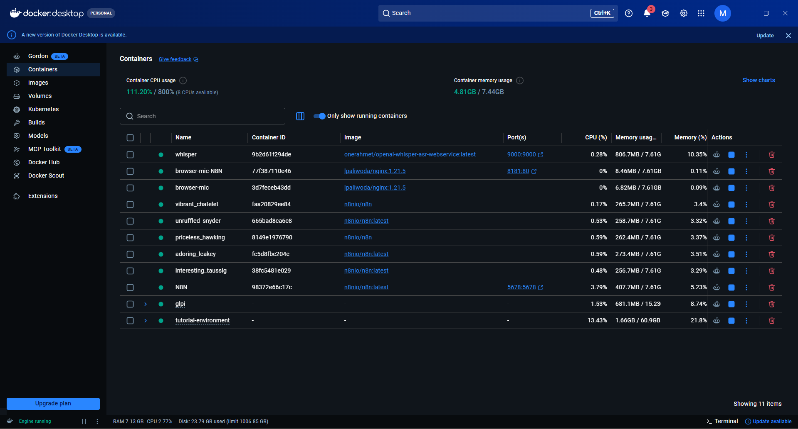

# Docker Services

## Overview

This project uses Docker Compose to orchestrate multiple containerized services. Two compose files manage different stacks:

1. **glpi-docker-compose.yml** — GLPI + MySQL
2. **tutorial-environment-docker-compose.yml** — n8n, Prometheus, Grafana, Loki, Promtail, sample app

## Running Containers Overview



**GLPI Stack**:
- `glpi-1` — GLPI application container (1.53% CPU, 681 MB memory)
- `glpi-db-1` — MySQL database (0.61% CPU, 152 MB memory)

**Monitoring & Automation Stack**:
- `whisper` — OpenAI API service for audio transcription
- `n8n` — Workflow automation engine
- `prometheus` — Metrics database
- `grafana` — Visualization dashboard
- `loki` — Log aggregation
- `promtail` — Log shipper
- `cadvisor` — Docker metrics exporter
- `app` — Sample Go application (monitoring target)

**Total Resource Usage** (from screenshot):
- CPU: 111.20% of 800% (multicore available)
- Memory: 4.81 GB of 7.44 GB (64.6% utilized)

## GLPI Stack

### File: infra/glpi-docker-compose.yml

```yaml
version: "3.8"
name: glpi
services:
  glpi:
    image: glpi/glpi:latest
    restart: unless-stopped
    ports:
      - "8080:80"
    volumes:
      - glpi_data:/var/glpi
    environment:
      GLPI_DB_HOST: db
      GLPI_DB_NAME: glpi
      GLPI_DB_USER: glpi
      GLPI_DB_PASSWORD: glpi123
    depends_on:
      - db

  db:
    image: mysql:8.0
    restart: unless-stopped
    volumes:
      - db_data:/var/lib/mysql
    environment:
      MYSQL_RANDOM_ROOT_PASSWORD: "yes"
      MYSQL_DATABASE: glpi
      MYSQL_USER: glpi
      MYSQL_PASSWORD: glpi123
```

### Services

#### glpi
- **Image**: `glpi/glpi:latest` (official GLPI Docker image)
- **Port**: 8080 (external) → 80 (internal)
- **Volume**: `glpi_data` stores config, cache, and plugins
- **Restart Policy**: `unless-stopped` (auto-restart if container exits unexpectedly)
- **Environment**: Database connection parameters

#### db
- **Image**: `mysql:8.0`
- **Volumes**: `db_data` stores database files
- **Restart Policy**: `unless-stopped`
- **Environment**: Root password randomized, create glpi database and user

### Common Commands

```bash
# Start GLPI stack
docker-compose -f infra/glpi-docker-compose.yml up -d

# View logs
docker-compose -f infra/glpi-docker-compose.yml logs -f glpi
docker-compose -f infra/glpi-docker-compose.yml logs -f db

# Stop stack
docker-compose -f infra/glpi-docker-compose.yml down

# Stop and remove volumes (DELETE DATA)
docker-compose -f infra/glpi-docker-compose.yml down -v
```

## Monitoring Stack

### File: infra/tutorial-environment-docker-compose.yml

Orchestrates 6 services:

#### n8n
```yaml
n8n:
  image: n8nio/n8n:latest
  restart: unless-stopped
  ports:
    - "5678:5678"
  environment:
    N8N_ENCRYPTION_KEY: ${N8N_ENCRYPTION_KEY}
    N8N_DB_TYPE: sqlite
```

- **Port**: 5678
- **Encryption**: Key from .env for credential security
- **Database**: SQLite (single-file, for dev; use Postgres for production)

#### Prometheus
```yaml
prometheus:
  image: prom/prometheus:latest
  restart: unless-stopped
  ports:
    - "9090:9090"
  volumes:
    - ./prometheus/prometheus.yml:/etc/prometheus/prometheus.yml
  command:
    - "--config.file=/etc/prometheus/prometheus.yml"
    - "--storage.tsdb.path=/prometheus"
```

- **Port**: 9090
- **Config**: Mounted from local file
- **Storage**: In-container (ephemeral)

#### Grafana
```yaml
grafana:
  image: grafana/grafana:latest
  restart: unless-stopped
  ports:
    - "3000:3000"
  environment:
    GF_SECURITY_ADMIN_PASSWORD: ${GRAFANA_ADMIN_PASSWORD}
  volumes:
    - ./grafana/provisioning:/etc/grafana/provisioning
```

- **Port**: 3000
- **Admin Password**: From .env
- **Provisioning**: Auto-configure data sources and dashboards

#### Loki
```yaml
loki:
  image: grafana/loki:latest
  restart: unless-stopped
  ports:
    - "3100:3100"
  command: -config.file=/etc/loki/config.yml
```

- **Port**: 3100 (API endpoint)
- **Config**: Default Loki config

#### Promtail
```yaml
promtail:
  image: grafana/promtail:latest
  restart: unless-stopped
  ports:
    - "9080:9080"
  volumes:
    - ./promtail/config.yml:/etc/promtail/config.yml
    - /var/lib/docker/containers:/var/lib/docker/containers:ro
```

- **Port**: 9080 (admin interface)
- **Config**: Mounted from local file
- **Volume**: Read-only access to Docker logs

#### app (TNS Sample)
```yaml
app:
  build: ../../dashboard/app/
  restart: unless-stopped
  ports:
    - "80:80"
```

- **Port**: 80 (HTTP)
- **Build**: From Dockerfile in dashboard/app/
- **Purpose**: Test/demo monitoring target

### Networking

By default, Docker Compose creates an internal network where services reach each other by name:

```
- n8n → `http://prometheus:9090`
- Promtail → `http://loki:3100`
- Prometheus → `http://app:80`
```

From host (Windows/macOS):

```
- n8n → `http://host.docker.internal:5678`
- Prometheus → `http://localhost:9090`
```

From host (Linux):

```
- Use container IP (find with `docker inspect`)
- Or use container name in host network
```

## Volume Management

### GLPI Data Persistence

```yaml
volumes:
  glpi_data:  # Named volume
    driver: local
  db_data:
    driver: local
```

Data stored in Docker Desktop:
- **Windows**: `C:\Users\<user>\AppData\Local\Docker\wsl\data\`
- **macOS**: `~/Library/Containers/com.docker.docker/Data/`
- **Linux**: `/var/lib/docker/volumes/`

To backup:

```bash
docker run --rm -v glpi_data:/data -v $(pwd):/backup \
  alpine tar czf /backup/glpi_data.tar.gz -C /data .
```

### Ephemeral Storage

Prometheus and Loki by default use container-internal storage:

```
/prometheus  # Inside prometheus container
/loki        # Inside loki container
```

These are lost if container is removed. To persist:

```yaml
prometheus:
  volumes:
    - prometheus_data:/prometheus

loki:
  volumes:
    - loki_data:/loki

volumes:
  prometheus_data:
  loki_data:
```

## Environment Configuration

### Using .env File

Docker Compose automatically loads `.env`:

```bash
# .env
N8N_ENCRYPTION_KEY=your_key
GRAFANA_ADMIN_PASSWORD=your_password
```

Reference in compose file:

```yaml
environment:
  N8N_ENCRYPTION_KEY: ${N8N_ENCRYPTION_KEY}
  GRAFANA_ADMIN_PASSWORD: ${GRAFANA_ADMIN_PASSWORD}
```

### Overriding with Command Line

```bash
docker-compose -f infra/glpi-docker-compose.yml up -d \
  -e GLPI_DB_PASSWORD=different_password
```

## Resource Limits

By default, containers use unlimited resources. To limit:

```yaml
services:
  n8n:
    deploy:
      resources:
        limits:
          cpus: "1.5"
          memory: 2G
        reservations:
          cpus: "0.5"
          memory: 512M
```

## Health Checks

To auto-restart unhealthy containers:

```yaml
services:
  glpi:
    healthcheck:
      test: ["CMD", "curl", "-f", "http://localhost/apirest.php/getGlpiConfig"]
      interval: 30s
      timeout: 10s
      retries: 3
      start_period: 40s
```

## Logs

### View Logs

```bash
# All services
docker-compose -f infra/glpi-docker-compose.yml logs

# Specific service
docker-compose -f infra/glpi-docker-compose.yml logs glpi

# Follow in real-time
docker-compose -f infra/glpi-docker-compose.yml logs -f

# Last 100 lines
docker-compose -f infra/glpi-docker-compose.yml logs --tail=100
```

### Log Drivers

By default, Docker uses `json-file` driver (stored locally):

```yaml
services:
  glpi:
    logging:
      driver: "json-file"
      options:
        max-size: "10m"
        max-file: "3"
```

For production, use centralized logging:

```yaml
logging:
  driver: "awslogs"  # AWS CloudWatch
  options:
    awslogs-group: "/ecs/glpi"
```

## Debugging Services

### Check if service is running

```bash
docker-compose ps
```

### Access service shell

```bash
docker-compose exec glpi sh
docker-compose exec db mysql -u glpi -p
```

### Inspect service config

```bash
docker-compose config | grep -A20 "services:"
```

### Check service network

```bash
docker network ls
docker inspect glpi_default
```

## Production Deployment

### Recommended Changes

1. **Use specific image tags** instead of `latest`:
   ```yaml
   image: glpi/glpi:10.0.13  # Instead of :latest
   ```

2. **Add restart policies**:
   ```yaml
   restart_policy:
     condition: on-failure
     delay: 5s
     max_attempts: 5
   ```

3. **Configure logging**:
   ```yaml
   logging:
     driver: json-file
     options:
       max-size: 10m
       max-file: 5
   ```

4. **Add health checks**:
   ```yaml
   healthcheck:
     test: CMD-SHELL
     interval: 30s
   ```

5. **Use orchestration**:
   - Kubernetes (docker-compose → helm charts)
   - Docker Swarm (use `docker stack deploy`)
   - Cloud platforms (AWS ECS, Azure Container Instances)

---

See [02-installation.md](02-installation.md) for setup commands.
